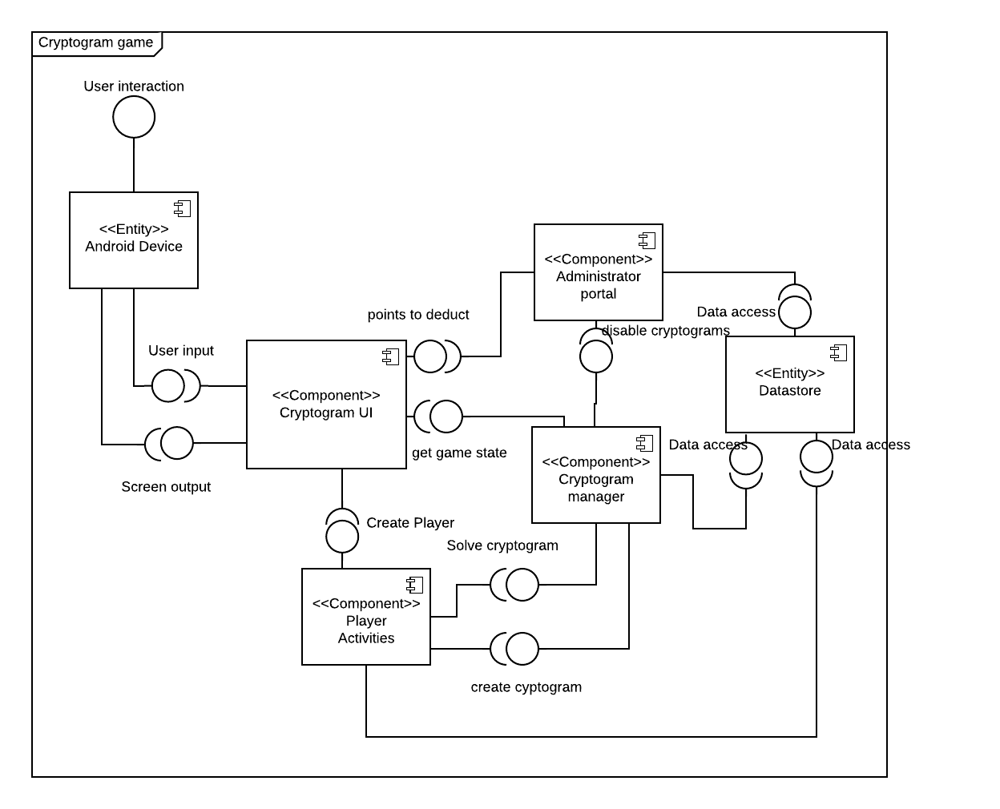
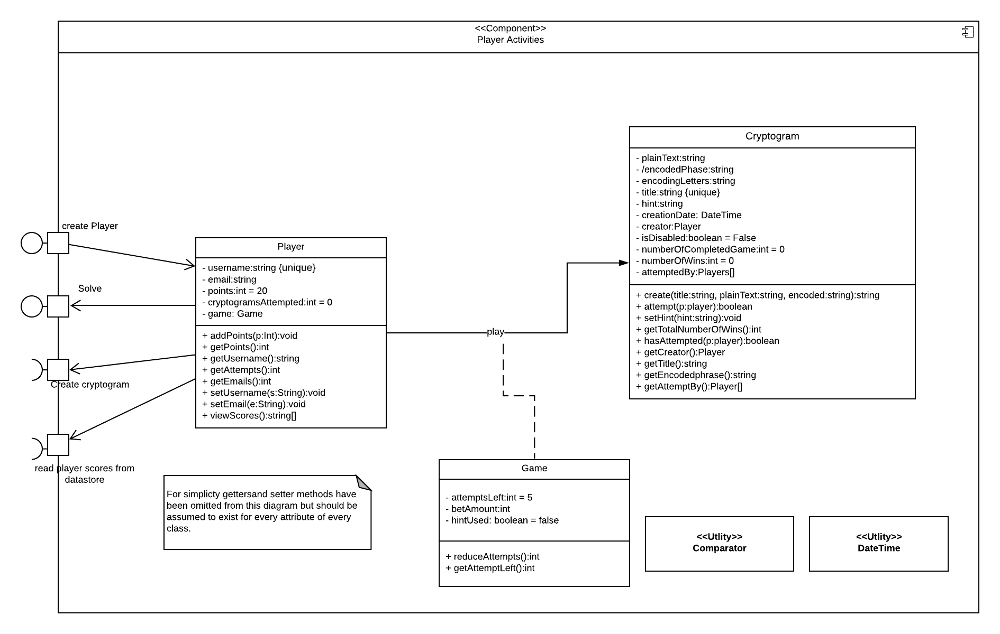
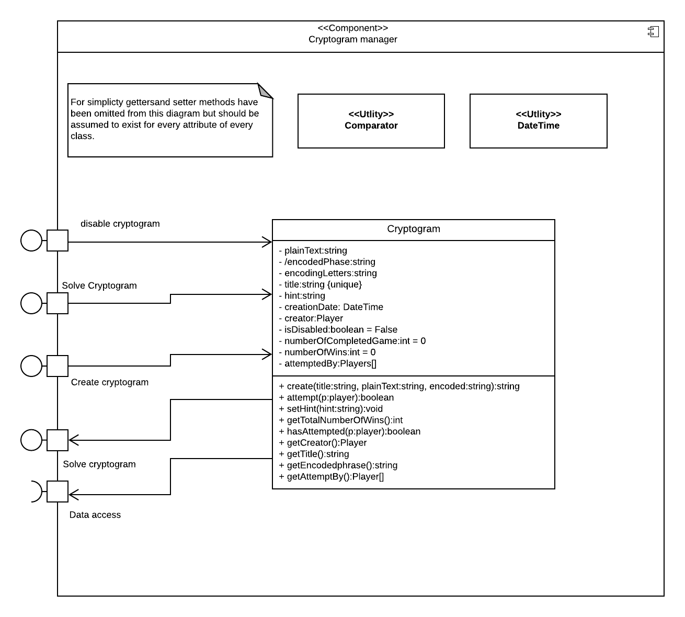
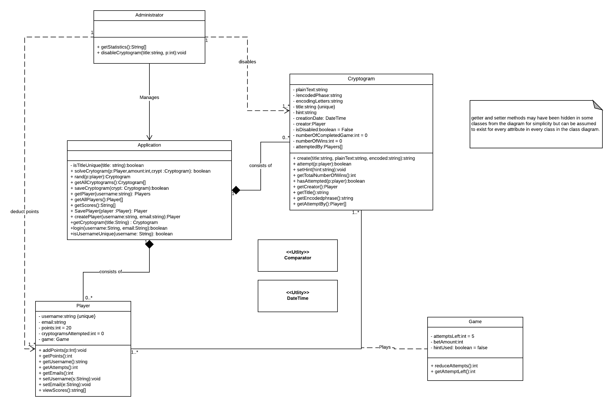
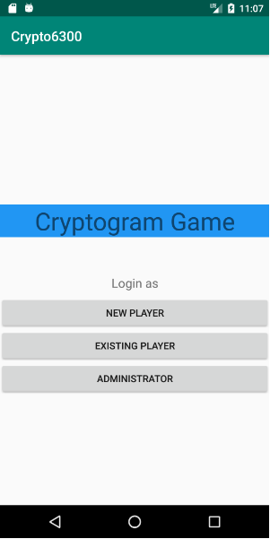
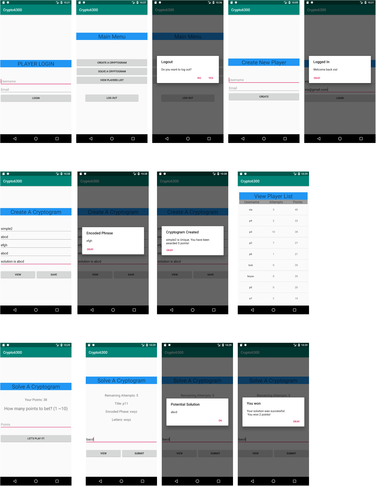
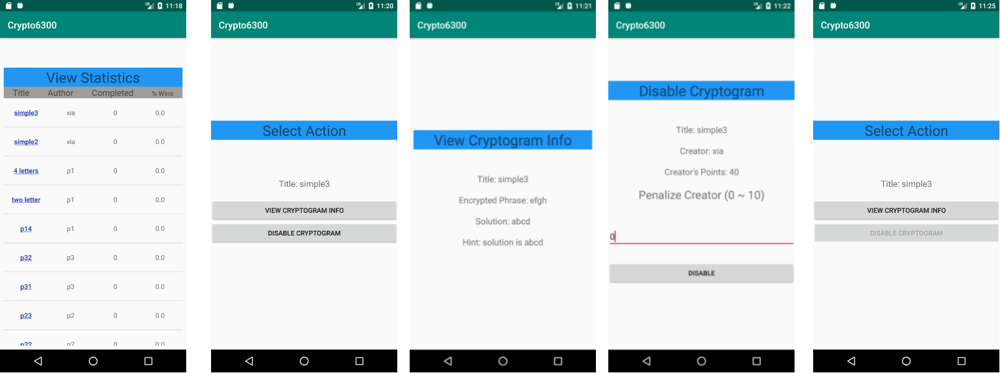

# Design Document

### Version Description

For Deliverable 3: Update User Interface Design

For Deliverable 4: Update Low Level Design and User Interface Design 

**Author**: \<6300Summer19Team08>

## 1 Design Consideration
### 1.1 Assumptions
- This application is designed to run on Android mobile devices.
- Development will happen in Android studio and will use the Java JDK.
- Player will know the rules of the game.
- Authentication is optional.
- Do not need to consider passwords and related security based on requirement
- There is a single system running the application.
- Only finished games (won/lost) are counted in player's number of attempted games.

### 1.2 Constraints

- Development tool : Android studio IDE
- SDK: Android SDK
- Programing Language: Java 8
- Language: English
- Input: Multi-touch
- Output: See section 1.3
- Device: See section 1.3 
- User Interface: Android pre-built UI components
- operating system: See section 1.3 

### 1.3 System Environment
#### Hardware
- Mobile Devices with screen size around 5''

#### Software
- Android Operating System (Version 6.0 or greater)

## 2 Architectural Design
### 2.1 Component Diagram

Diagram above shows the component diagram of the system and the various clusters of related functionality that are grouped into components.

### 2.2 Deployment Diagram
The deployment of this application is in the form of an APK installed on a single Android phone. From the requirements of the system where asked to assume that only a single system is running the application. Due to the simple nature of the deployment, we determined that a deployment diagram was not necessary, and a textual description was more appropriate.

## 3 Low-Level Design

In the component diagram in section 2.1 the **Android Device** and **Datastore** represent business concepts of the application. The **Datastore** is used for data storage and retrieval, while the **Android Device** is used to obtain user input and output data to the user. As such these two components are stereotyped as <<Entity>> to represent their purpose in the diagram.

3.0.1. **Administrator portal** component is used to manage the application, it provides the functionality of getting a collection of cryptogram statistics and disabling cryptograms which eventually deduct points from the creator of the cryptogram. It also accesses the datastore where cryptogram data is stored using a port.

3.0.2. **Player Activities** This component handles the creation of a new player and login of a player. It has two ports which depend on the **Cryptogram manager component** to create a cryptogram and to solve a cryptogram.

3.0.3. **Cryptogram UI** component takes user input from the touch screen of the Android device, and sends output to the Android device for the end user to see. It is made up of the various activities of the android application. Because this component is part of GUI its implementation is not reflected in the design

3.0.4 **Cryptogram manager** component provides an interface for players to solve and create cryptograms, and also an interface for the administrator to disable a cryptogram. It stores and retrieves cryptogram data in the datastore. It provides the information about the cryptogram to the UI for display to the user.

### 3.1 Class Diagram

## 4 User Interface Design
#### Application Login:

#### UI for Players:

#### UI for Administrators:

