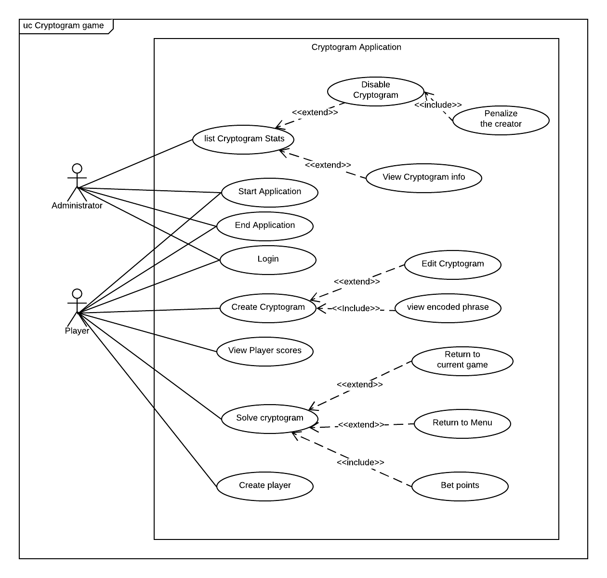

# Use Case Model

**Author**: \<6300Summer19Team08>

## 1 Use Case Diagram

## 2 Use Case Descriptions

### Disable Cryptogram

-  *Actor*: Administrator
-  *Requirements:* To discourage the creation of unfair cryptograms, the administrator should be able to disable the cryptogram.
-  *Pre-conditions:* The user must be logged in as an administrator and there must exist at least one cryptogram in the game
-  *Post-conditions:* A disabled cryptogram will not be randomly selected in the future for any players starting a game, but will not affect any previous or in progress games

*Scenarios:*

This use case extends the *list cryptogram stats* use case and includes the penalize the creator use case.

1. User logs in as an administrator
2. Views list of cryptograms from newest to oldest
3. The administrator may select any cryptogram
4. Disable the cryptogram and penalize its creator of that cryptogram by deducting between 0 and 10 points from their total points.

### View Cryptogram info

-  *Actor*: Administrator
-  *Requirements:* The administrator may select a cryptogram from a list of cryptogram entries to view its encrypted phrase, solution phrase, and hint.
Each cryptogram will show its title, its creator’s username, the number of games using that cryptogram completed by all players, and the percentage of wins out of total completed games.
-  *Pre-conditions:* The user must be logged in as an administrator and there must exist at least one cryptogram in the game
-  *Post-conditions:* Administrator is presented with the encrypted phrase, solution phrase, and the hint of the cryptogram selected

*Scenarios:*

This use case extends the *list cryptogram stats* use case
1. User logs in as an administrator
2. Views list of cryptograms from newest to oldest
3. The administrator may select any cryptogram
4. View its encrypted phrase, solution phrase, and hint

  

### List Cryptogram Stats

-  *Actor*: Administrator
-  *Requirements:* The administrator can view the list of cryptogram statistics. Each cryptogram will show its title, its creator’s username, the number of games using that cryptogram completed by all players, and the percentage of wins out of total completed games.
-  *Pre-conditions:* The user must be logged in as an administrator and there must exist at least one cryptogram in the game
-  *Post-conditions:* Administrator is presented with a list of cryptogram statistics from newest to oldest

*Scenarios:*
1. User logs in as an administrator
2. Views list of cryptograms from newest to oldest

  

### Penalize the creator

-  *Actor*: Administrator
-  *Requirements:* To discourage the creation of unfair cryptograms, between 0 and 10 points (or the player’s total number of points, if that is less) are deducted from the creator of a cryptogram when it is disabled.
-  *Pre-conditions:* The user must be logged in as an administrator and there must exist at least one cryptogram in the game created by a player.
- *Post-conditions:* A disabled cryptogram will not be randomly selected in the future for any players starting a game, but will not affect any previous or in progress games and the number of points selected by the administrator will be deducted.

  *Scenarios:*

  This use case is included in the *disable cryptogram* use case,

1. User logs in as an administrator
2. Views list of cryptograms from newest to oldest
3. The administrator may select any cryptogram
4. Disable the cryptogram and penalize its creator of that cryptogram by deducting between 0 and 10 points from their total points.

  

### Start Application
- *Actor*: Administrator, Player

- *Requirements:* Administrator/Player should be able to start the application

- *Pre-conditions:* The Cryptogram Application is not running.

- *Post-conditions:* The Cryptogram Application starts successful and starts at the login page.

  *Scenarios:*
  Actor clicks on the application icon to start the app.

  

### End Application

- *Actor*: Administrator, Player

- *Requirements:* Administrator/Player should be able to terminate the application

- *Pre-conditions:* The Cryptogram Application is running.

- *Post-conditions:* The Cryptogram Application terminates.

  *Scenarios:*
  The actor uses the android task manager to kill the app.

  

### Login

-  *Actor*: Player, Administrator
-  *Requirements:* Player/Administrator should be able to login into the application
-  *Pre-conditions:* The Player/Administrator is not logged in.
-  *Post-conditions:* Player/Administrator becomes logged in as Player/Administrator.

 *Scenarios:*
On the main menu, the end user chooses to log in as either a new player or an existing player or Administrator.

  

### Create player
-  *Actor*: Player
-  *Requirements:* A player can log in as a new player
-  *Pre-conditions:* New player with selected username does not exist.
-  *Post-conditions:* New player added to list of existing players. New players start with 20 points.

  *Scenarios:*
1. A new player can log in by entering their username which must be unique
2. They also enter an email address.

  

### View Player scores

- *Actor*: Player

- *Requirements:* The application will allow existing players to view the list of player scores.

- *Pre-conditions:* player logged in as an existing player and at least one player exists in the game.

- *Post-conditions:* The list of player scores will display a list of players in descending order of total points. The entry for each player will show their username, the number of cryptograms attempted, and their total number of points.

  *Scenarios:*

  On the main menu, after logging in as an existing player, a player can select the option to view player scores.

### Edit Cryptogram

-  *Actor*: Player
-  *Requirements:* Player can edit the title, solution phrase, encoding letters during the addition of a new cryptogram
-  *Pre-conditions:* In the process of creating a new cryptogram.
-  *Post-conditions:* Edited value replace original values.

 *Scenarios:*
1. Player will enter a unique cryptogram title.
2. Player will enter a solution (unencoded) phrase.
3. Player then Selects unique encoded letters to replace each unique letter in the solution phrase and ensures no letter may be encoded to itself.

  

### view encoded phrase
-  *Actor*: Player
-  *Requirements:* Player can View the resulting encoded phrase, with capitalization and any non-alphabetic characters preserved during cryptogram creation
-  *Pre-conditions:* A title, unencoded string, and unique encoded letters are entered by the player.
-  *Post-conditions:* Encoded phrase with capitalization and any non-alphabetic characters preserved is displayed to the user

 *Scenarios:*
1. Player will enter a unique cryptogram title.
2. Player will enter a solution (unencoded) phrase.
3. Player then Selects unique encoded letters to replace each unique letter in the solution phrase and ensures no letter may be encoded to itself.
4. The player can View the resulting encoded phrase, with capitalization and any non-alphabetic characters preserved.

### Create Cryptogram
-  *Actor*: Player
-  *Requirements:* Players can add new cryptogram
-  *Pre-conditions:* title of new cryptogram must not exist.
-  *Post-conditions:* New cryptogram is created.

*Scenarios:*
1. Player will enter a unique cryptogram title.
2. Player will enter a solution (unencoded) phrase.
3. Player then Selects unique encoded letters to replace each unique letter in the solution phrase and ensures no letter may be encoded to itself.
4. The player can View the resulting encoded phrase, with capitalization and any non-alphabetic characters preserved.
5. Player will enter a hint phrase (to help players solve the puzzle).
6. Player then save the complete cryptogram.

### Solve cryptogram

-  *Actor*: Player
-  *Requirements:* Player should be able to solve random cryptograms they have not attempted.
-  *Pre-conditions:* A player must be logged in and there must exist a cryptogram not attempted by the logged in player.
-  *Post-conditions:* Player is given a game to solve by the application.

*Scenarios:*
1. The player is prompted to bet a number of their points on solving the next cryptogram, with a minimum of 1 and a maximum of 10, or all of their points, whichever is less.
2. They will then be shown a random cryptogram which they have not attempted to solve before and did not create.
3. The system will display the cryptogram title and encrypted text along with a number of attempts remaining in the game, starting at five.
4. The player will match possible replacement and encrypted letters together, and view the resulting potential solution.
When all letters in the cryptogram are replaced and they are satisfied with the potential solution, the player may submit their answer.
5. The player will view a result indicating that the solution was successful, or decrementing the number of solution attempts remaining if it was unsuccessful.
When there are two attempts remaining, the cryptogram hint will be displayed.
6. At any point, the player may return to the menu, but choosing to solve a cryptogram will return to the same attempt for the current cryptogram.
7. when the number of solution attempts reaches zero, they will get a result displaying that the cryptogram game was lost and the change in their total points. The number of points bet will be removed from their total. They will then return to the menu.
8. When the player solves the cryptogram, they get a result displaying that the cryptogram game was won and the change in their total points. If no hints were displayed, they will have the number of points bet added to their score. Otherwise, no points will be added and their total will be unchanged. They will then return to the menu.

### Return to current game

-  *Actor*: Player
-  *Requirements:* At any point, the player may return to the menu, but choosing to solve a cryptogram will return to the same attempt for the current cryptogram.
-  *Pre-conditions:* Player has chosen to solve a random cryptogram which has not been solved and is currently in the menu.
-  *Post-conditions:* Player is returned to the same attempt for the current cryptogram.

*Scenarios:*
1. The player is logged in as an existing player
2. Chooses a solve a new random cryptogram
3. navigates to the menu of the application at any time
4. Choose the open to solve a cryptogram and is returned to the current cryptogram.

### Bet points
-  *Actor*: Player
-  *Requirements:* When a player chooses to solve a random cryptogram, they will be prompted to bet a number of their points on solving the next cryptogram, with a minimum of 1 and a maximum of 10, or all of their points, whichever is less.
-  *Pre-conditions:* Player chooses to solve a random game that they have not attempted before and enters a value between 1 and 10 (or all of their points, whichever is less)
-  *Post-conditions:* Prompt disappears after value is entered

*Scenarios:*
1. If the player successfully solves the cryptogram, they will get a result displaying that the cryptogram game was won and the change in their total points
2. If the player solved the cryptogram before the hint was displayed, they will have the number of points bet added to their score
3. Otherwise, no points will be added and their total will be unchanged

### Return to Menu
-  *Actor*: Player
-  *Requirements:* At any point, the player may return to the menu.
-  *Pre-conditions:* The Player is solving a cryptogram.
-  *Post-conditions:* The menu of the application is displayed to the user.

*Scenarios:*
1. The player is solving the cryptogram
2. Player then decides to go to the main menu at any point